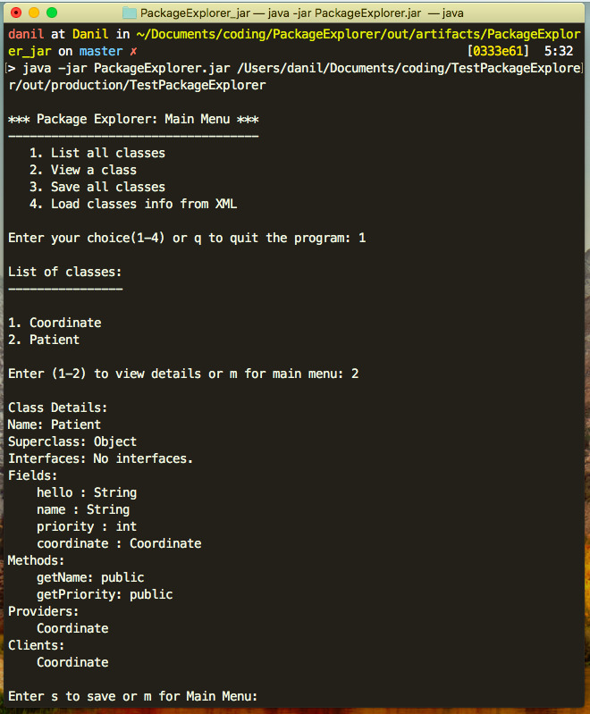

# Package Explorer
> PackageExplorer program allows you to get information about java classes in a specified directory.



# Description
Package Explorer uses Java Reflection API to list all the .class files in the specified directory and let a user view the details of each class. (Class name, SuperClass, Interface, Fields, Methods, Providers, Clients).

* Providers - list of classes within the same directory that this class depends on. 
* Clients - list of classes within the same directory that depend on this class.

The program allows saving individual/all class files in XML by serializing with Java's XMLEncoder library. You can load files back in the program by choosing to load previosly saved XML file containing all classes.  

## Usage

Terminal:

Open the folder containing jars and run:

```sh
java -jar PackageExploere.jar /Users/danil/Desktop/SomeJavaProject/out
```
If the first argument is empty, program will search for .class files in the current directory.
 
## Meta

Please feel free to reach to me :)

Danil Kolesnikov – danil.kolesnikov@sjsu.edu

Distributed under the MIT license.
